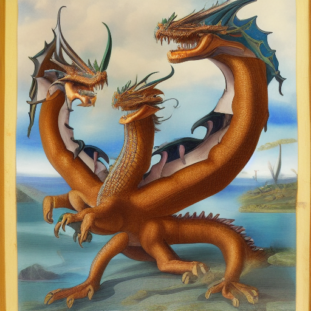

# What is Tydra?

TinyUSDZ does not support Hydra interface in pxrUSD at the moment.
We think Hydra(multi-purpose sceneDelegate/renderDelegate interface) is too much for TinyUSDZ usecases(AR, lightweight 3D viewer/runtime, DCC exchange, etc).

Instead, we'd like to propose Tydra(Tiny Hydra), something like a three-headed monster(Please imagine Gidorah: https://en.wikipedia.org/wiki/King_Ghidorah), which directly converts(`publishes`) USD scene graph(Stage. Prim hierarchy) to a renderer-friendly data structure or `published` data format(imagine glTF). API design of Tydra is completely different from Hydra.

Currently Tydra is considering following three usecases in mind:

- Runtime publishment(e.g. to glTF), DCC conversion and exchange for realtime graphics(AR, VR, MR, games, etc).
- Scene conversion to GL/Vulkan renderer(e.g. WebGL rendering)
- Scene conversion to Ray tracing renderer(e.g. Vulkan/OptiX ray tracing)
  See `../../examples/sdlviewer/` for SW raytracing example.

## Status

Work in progres. API and feature is subject to change.

## RenderScene

Scene graph representation suited for OpenGL/Vulkan renderer.

### Status

* [ ] Node xform
* [x] Triangulate mesh
* [ ] Subdivision surface support(subdivide mesh using OpenSubdiv)
* [x] Resolve Material binding
  * [x] GeomSubset material binding
  * [ ] Collection material binding 
* [ ] Load and setup Texture
  * Colorspace conversion
    * [x] sRGB <-> Linear
    * [x] rec709 <-> Linear
    * [ ] OCIO LUT
    *  
* [ ] Skinning
* [ ] BlendShape
* [ ] Animation
* [ ] Lights
    
## TODO

- Data structure suited for realtime DCC.
- Data structure suited for Ray tracing

EoL.

