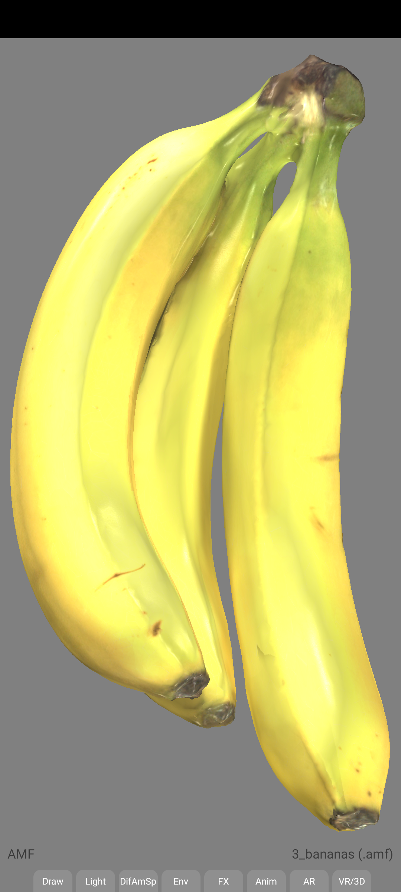
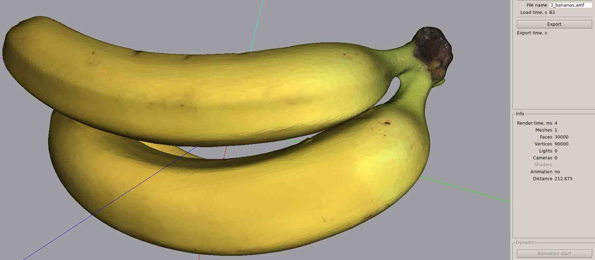

# AMF 3D model reference images

## 3_bananas.amf
(Note: need to flip UVs when rendering)

## 3_bananas.amf embedded texture
3_bananas.amf embeds a strange-looking but valid texture, which when applied to the model renders correctly.

(Note that this is a relatively rare example of a 3D model with an "uncompressed" embedded texture,
may be useful for developers looking to test their assimp embedded texture implementations)

