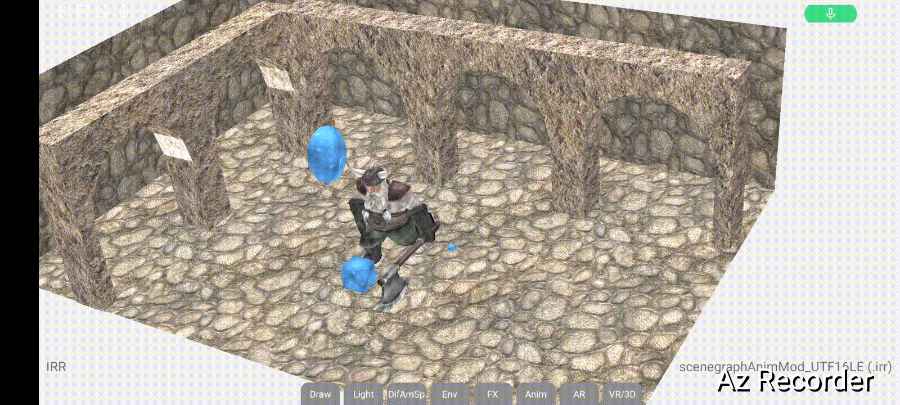
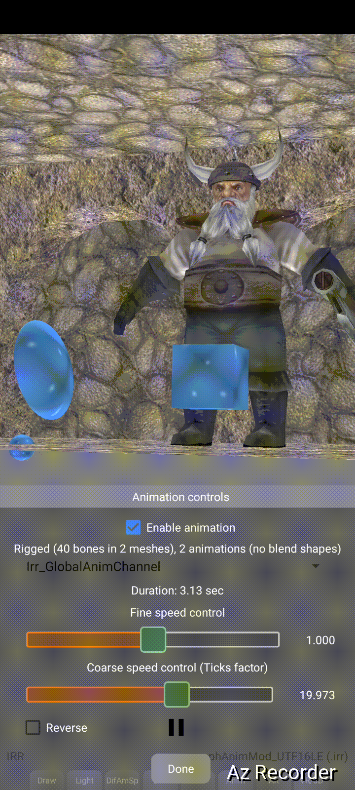

# IRR 3D model reference images

## scenegraphAnimMod_UTF16LE.irr

### Animation "AnimationSet0"
Dwarf animated; primitive objects not animated

### Animation "Irr_GlobalAnimChannel"
Primitive objects animate; dwarf not animated (Animation playback sped up significantly)

