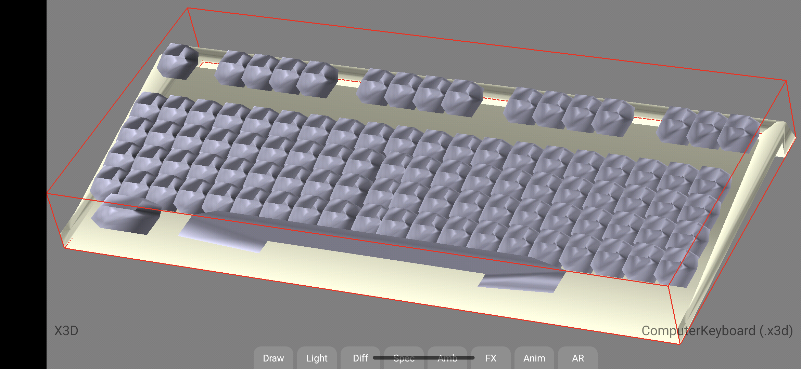
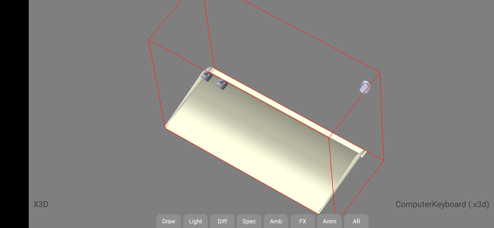
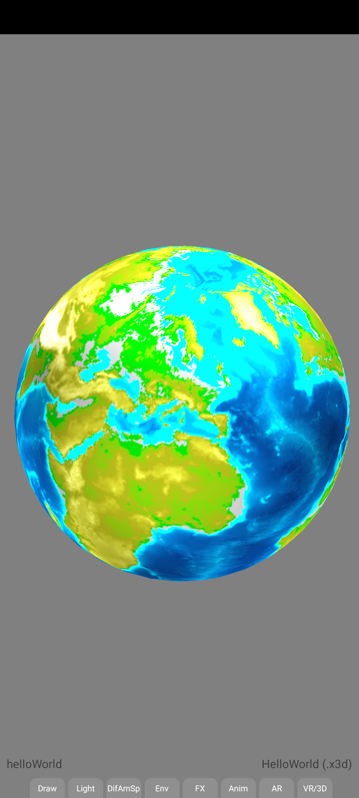

# X3D 3D model reference images

## ComputerKeyboard.x3d

### Working (using IRR xml parser)
ComputerKeyboard as of 29 Sep 2020 git commit `6a4c338`, using IRR xml parsing, renders OK:

### Broken (using pugi xml parser)
ComputerKeyboard as of 1 Dec 2021 git commit `1614934`, using pugi xml parsing, renders with 
missing meshes and obvious artifacts:

## HelloWorld.x3d

